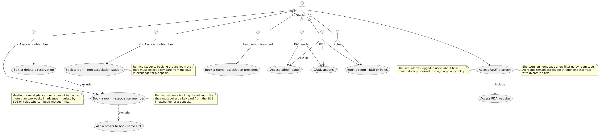
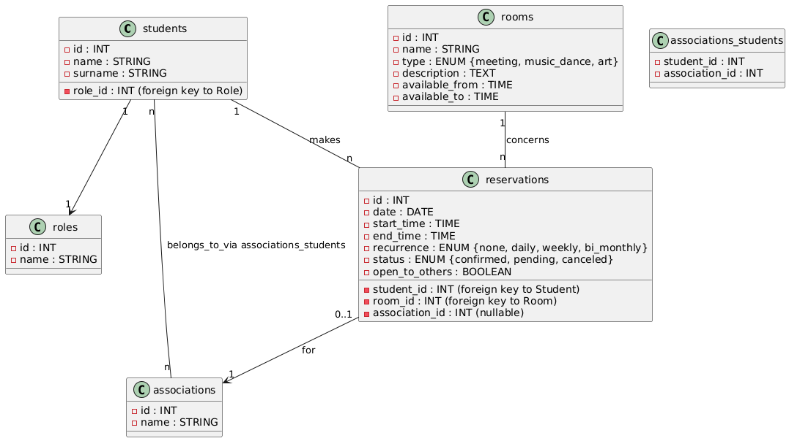

#  RéUT - Room Management for UTC

## 📃 Table of Contents

* [💬 Introduction](#💬-introduction)
* [✨ Features](#✨-features)
* [🖋️ Authors & Contribution](#🖋️-authors--contribution)
* [🔧 Setup](#🔧-setup)

  * [⚙️ Backend](#⚙️-backend)
  * [🗃️ Database](#🗃️-database)
  * [🖥️ Frontend](#🖥️-frontend)
* [📂 Use Case Diagram](#📂-use-case-diagram)
* [🖁️ Database Schema](#🖁️-database-schema)
* [🔑 OAuth Setup](#🔑-oauth-setup)
* [⚖️ License](#⚖️-license)
* [📧 Contact](#📧-contact)

## 💬 Introduction

**RéUT** is a web platform developed at [UTC](https://www.utc.fr/) to simplify and centralize room booking and management for student associations. The tool supports both individual students and student clubs, providing a seamless experience to check availability, book rooms, and manage bookings through a responsive, intuitive interface.

The platform is actively developed as part of a student initiative in collaboration with the SiMDE and the BDE.


## ✨ Features

* OAuth 2.0 login through the UTC auth portal
* Reservation system for different types of users (student, asso member, president, BDE)
* Admin panel for room and request management
* Role-based permissions (associations, BDE, SiMDE)
* Mobile-friendly responsive UI
* Dark/light mode switch (planned)
* Notification system (planned)

## 🖋️ Authors & Contribution

**Main Developer:** Jeannette (PR project @ UTC)

**Support & Guidance:**

* Quentin BOYER
* Eliot DEWULF
* Stéphane BONNET (supervisor)

Interested in contributing? Contact us via email or GitLab!

## 🔧 Setup

### ⚙️ Backend

```bash
composer install
cp .env.example .env
php artisan key:generate
php artisan serve
```

### 🗃️ Database

* Configure DB credentials in `.env`
* Create the schema:

```bash
php artisan migrate --seed
```

* If needed:

```bash
php artisan migrate:fresh && php artisan db:seed
```

### 🖥️ Frontend

```bash
npm install
npm run dev
```

## 📂 Use Case Diagram



## 🖁️ Database Schema



## 🔑 OAuth Setup

To enable OAuth login:

1. Create your app at [https://auth.assos.utc.fr/admin](https://auth.assos.utc.fr/admin)
2. Get your `client_id`, `client_secret`, and set redirect URI: `http://localhost:8000/auth/callback`
3. Add to `.env`:

```env
OAUTH_CLIENT_ID=...
OAUTH_CLIENT_SECRET=...
OAUTH_REDIRECT_URI=http://localhost:8000/auth/callback
```

4. Update `config/services.php` accordingly
5. Routes:

```php
Route::get('/auth/login', [AuthController::class, 'login'])->name('login');
Route::get('/auth/callback', [AuthController::class, 'callback']);
Route::post('/auth/logout', [AuthController::class, 'logout'])->name('logout');
```

6. Test it at `http://localhost:8000/auth/login`

## ⚖️ License

This project is distributed under the [Creative Commons Attribution-NonCommercial 4.0](https://creativecommons.org/licenses/by-nc/4.0/) license.

## 📧 Contact

Questions or feedback? Email **jeannette** or reach out via GitLab
(jeannette.garea.c@gmail.com).

